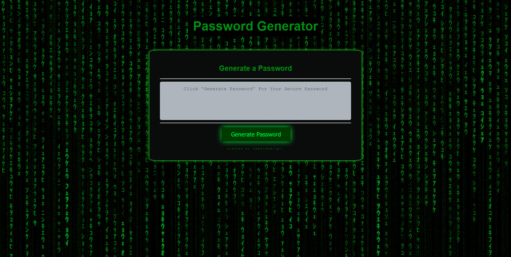

# Password Generator
### About:
This is my first application I've created using JavaScript. Even though, the result is fairly simple, it was pretty challenging at the beginning to understand the logic step by step and code it accordingly. I did some research about how text-generators work in general, and I tried my best to implement the neatest way to code this program.

### Usage:
1- Click `Generate Password`\
2- Enter the password length `between 8-128 characters`\
3- Select if password will include `lowercase letters`\
4- Select if password will include `uppercase letters`\
5- Select if password will include `numbers`\
6- Select if password will include `special characters`\
7- Password generated.

### Improvements:
>Select all generated password & copy button can be added eventually for efficient usage.

### Code:
I've learned new methods and syntax while creating this program including;\
*Object Constructors*,\
*Filtering*,\
*Advanced usage of Arrays & Objects*,\
*forEach*,\
*Arrow Functions*

### Webpage:
https://kemaldemirgil.github.io/password-generator/ \

### License:

Copyright © Kemal Demirgil. All rights reserved.
Licensed under the [MIT](https://github.com/kemaldemirgil/password-generator/blob/main/LICENSE) license.

